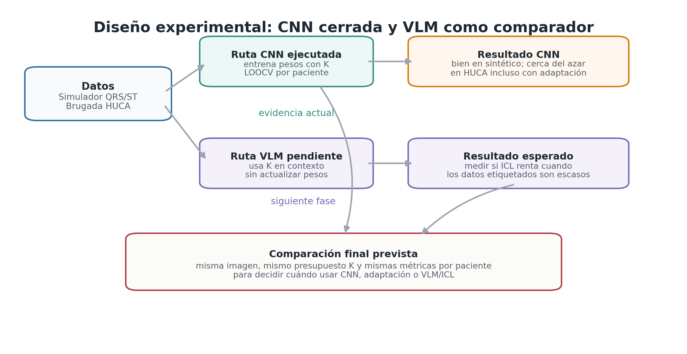

# ECG como imagen para Brugada con pocos ejemplos

Repositorio del Trabajo de Fin de Grado sobre analisis de electrocardiogramas como imagen en un escenario de pocos pacientes etiquetados. El objetivo es comparar dos formas de usar los mismos ejemplos:

- una CNN supervisada que ajusta pesos con los pacientes disponibles
- un modelo de vision y lenguaje, Gemma 4, que usa esos pacientes como demostraciones dentro del contexto

El sistema no se plantea como diagnostico autonomo. Todos los resultados deben leerse como investigacion metodologica y posible apoyo a triaje, siempre subordinado a revision clinica especializada.

PDF final:

- [Memoria compilada](thesis/thesis/TFG_GCID_Memoria_Moris_Lara_Alejandro_2026_07.pdf)
- [Fuente LaTeX principal](thesis/thesis/main.tex)

## Idea central

El problema experimental es medir que ocurre cuando el ECG solo esta disponible como imagen y el numero de positivos confirmados es pequeno. En ese contexto, entrenar un modelo especifico puede ser inestable, pero usar un VLM en zero-shot tampoco es suficiente. El trabajo estudia el punto intermedio: aprendizaje en contexto con pocos ejemplos.



## Datos

| Conjunto | Pacientes | Imagenes | Positivos | Negativos | Etiqueta |
|---|---:|---:|---:|---:|---|
| Simulador QRS/ST | 100 | 300 | 20 | 80 | Regla morfologica |
| Datos cedidos por el HUCA | 317 | 951 | 116 | 201 | `clinical_brugada` |

El simulador genera imagenes V1, V2 y V3 con etiquetas independientes para:

- `RBBB`
- `ST_ELEVATION`
- `T_WAVE_INVERSION`

La etiqueta positiva derivada exige los tres hallazgos a la vez:

```text
RBBB and ST_ELEVATION and T_WAVE_INVERSION -> Brugada derivado
```

Los datos cedidos por el Hospital Universitario Central de Asturias no contienen esas anotaciones morfologicas independientes por imagen. Solo aportan la referencia clinica `clinical_brugada`. Por eso no se entrena una CNN supervisada real-real con la arquitectura morfologica actual. La evaluacion real de la CNN es transferencia desde el simulador hacia la cohorte clinica.

## Protocolo

La evaluacion es leave-one-out por paciente. El paciente reservado nunca aparece en entrenamiento, validacion ni contexto.

| Enfoque | Que significa \(K\) | Como usa los ejemplos |
|---|---|---|
| CNN ResNet18 | Pacientes de entrenamiento | Actualizan pesos mediante perdida supervisada |
| VLM/ICL Gemma 4 | Demostraciones de contexto | Se insertan en el prompt sin modificar pesos |

Valores usados:

```text
K = 2, 4, 8, 16, 32
Zero-shot VLM = K = 0
Semillas = 42, 123, 2026
```

La CNN produce tres probabilidades morfologicas. El umbral se selecciona dentro de cada pliegue usando solo validacion y maximizando exactitud equilibrada. El paciente de test se evalua con ese umbral ya fijado.

## Orden de resultados

La lectura final se organiza de lo mas sintetico a lo mas real:

1. Simulador puro.
2. Transferencia sintetico-real con adaptacion de dominio CNN y VLM con contexto del simulador.
3. Evaluacion directa con los datos cedidos por el HUCA: CNN transferida desde simulador y Gemma 4 con contexto real.

## Resultados en simulador

En el dominio sintetico, ambos enfoques encuentran senal visual. La CNN aprovecha mejor el aumento de ejemplos, mientras que Gemma 4 mejora claramente frente a zero-shot cuando recibe demostraciones.

| Metodo | \(K\) | BA | F1 | Sens. | Esp. |
|---|---:|---:|---:|---:|---:|
| CNN ResNet18 | 32 | 0.848 | 0.673 | 0.883 | 0.812 |
| Gemma 4 zero-shot | 0 | 0.500 | 0.000 | 0.000 | 1.000 |
| Gemma 4 ICL normal | 16 | 0.750 | 0.529 | 0.817 | 0.683 |
| Gemma 4 ICL balanceado | 8 | 0.754 | 0.511 | 0.950 | 0.558 |


## Transferencia sintetico-real

La brecha entre simulador y datos clinicos es el resultado mas importante. El buen rendimiento en sintetico no se conserva automaticamente cuando la referencia pasa a ser clinica.

### Adaptacion de dominio CNN

Se probaron variantes no supervisadas usando el simulador como origen etiquetado y los datos cedidos por el HUCA como dominio objetivo no etiquetado.

| Metodo | \(K\) | BA | F1 | Sens. | Esp. |
|---|---:|---:|---:|---:|---:|
| Base | 16 | 0.516 | 0.480 | 0.658 | 0.375 |
| SSL | 16 | 0.477 | 0.458 | 0.658 | 0.297 |
| CORAL | 16 | 0.524 | 0.481 | 0.641 | 0.408 |
| MMD | 16 | 0.516 | 0.474 | 0.635 | 0.396 |
| DANN | 16 | 0.515 | 0.470 | 0.621 | 0.410 |
| Base | 32 | 0.499 | 0.466 | 0.644 | 0.355 |
| SSL | 32 | 0.503 | 0.476 | 0.672 | 0.333 |
| CORAL | 32 | 0.528 | 0.480 | 0.632 | 0.423 |
| MMD | 32 | 0.549 | 0.498 | 0.649 | 0.448 |
| DANN | 32 | 0.509 | 0.472 | 0.644 | 0.375 |

MMD con \(K=32\) es el mejor punto de esta bateria, con BA 0.549. La mejora es real pero modesta.

### ICL con contexto del simulador

Tambien se evaluo Gemma 4 con demostraciones sinteticas y consulta sobre la cohorte clinica. Este control mide si el contexto morfologico del simulador transfiere al dominio real.

| Condicion | \(K\) | BA | F1 | Sens. | Esp. |
|---|---:|---:|---:|---:|---:|
| Zero-shot | 0 | 0.500 | 0.000 | 0.000 | 1.000 |
| ICL normal | 16 | 0.501 | 0.006 | 0.003 | 0.998 |
| ICL normal | 32 | 0.500 | 0.006 | 0.003 | 0.997 |
| ICL balanceado | 8 | 0.501 | 0.006 | 0.003 | 1.000 |
| ICL balanceado | 32 | 0.505 | 0.022 | 0.011 | 0.998 |

El modelo permanece casi siempre colapsado hacia la clase negativa. Esto refuerza que no basta con proporcionar ejemplos si proceden de un dominio visual y semantico demasiado alejado del objetivo clinico.


## Evaluacion con datos reales cedidos por el HUCA

La comparacion principal en datos reales enfrenta:

- CNN entrenada con simulador y evaluada con la cohorte clinica
- Gemma 4 con demostraciones tomadas de la propia cohorte clinica

| Metodo | \(K\) | BA | F1 | Sens. | Esp. |
|---|---:|---:|---:|---:|---:|
| CNN ResNet18 base | 16 | 0.516 | 0.480 | 0.658 | 0.375 |
| CNN MMD | 32 | 0.549 | 0.498 | 0.649 | 0.448 |
| Gemma 4 zero-shot | 0 | 0.508 | 0.044 | 0.023 | 0.993 |
| Gemma 4 ICL normal | 16 | 0.522 | 0.491 | 0.690 | 0.355 |
| Gemma 4 ICL balanceado | 16 | 0.522 | 0.496 | 0.713 | 0.332 |
| Gemma 4 contexto sintetico | 32 | 0.505 | 0.022 | 0.011 | 0.998 |

El zero-shot de Gemma 4 muestra una decision conservadora casi monoclase. Con pocos ejemplos reales en contexto, el modelo aumenta mucho la sensibilidad, aunque a costa de reducir la especificidad. En ese sentido, el ICL resulta efectivo como mecanismo metodologico de adaptacion rapida frente a zero-shot, pero no alcanza robustez clinica.


## Brecha de dominio

La diferencia entre simulador y datos clinicos aparece en los dos enfoques.


Lectura principal:

- el simulador funciona como banco controlado
- la transferencia directa desde simulador a datos reales es debil
- la adaptacion de dominio mejora parcialmente la CNN
- el contexto sintetico no transfiere bien al VLM
- el contexto real cambia el comportamiento de Gemma 4, pero no basta para uso clinico

## Estructura del repositorio

```text
src/ecg_few/                    Codigo Python principal
scripts/run/                    Entradas reproducibles de ejecucion
scripts/eval/                   Comparaciones y auditorias
scripts/thesis/                 Figuras para la memoria
prompts/                        Prompts VLM estructurados
thesis/thesis/                  Memoria LaTeX y PDF final
thesis/thesis/assets/results/   Figuras versionadas de resultados
```

## Reproduccion

Instalacion base:

```bash
uv sync --extra dev --extra cnn
```

Si se reconstruyen los datos reales desde WFDB:

```bash
uv sync --extra dev --extra cnn --extra real-data
```

Construir datasets:

```bash
scripts/run/build_simulator_qrs_dataset.sh
scripts/run/build_brugada_huca_dataset.sh
```

Ejecutar CNN:

```bash
RESUME=0 scripts/run/run_cnn_simulator_qrs_loocv.sh
RESUME=0 scripts/run/run_cnn_loocv.sh
```

Ejecutar adaptacion de dominio:

```bash
METHOD=coral RESUME=0 scripts/run/run_cnn_domain_adaptation_loocv.sh
METHOD=mmd RESUME=0 scripts/run/run_cnn_domain_adaptation_loocv.sh
METHOD=dann RESUME=0 scripts/run/run_cnn_domain_adaptation_loocv.sh
METHOD=none SSL_PRETRAIN_EPOCHS=3 OUTPUT_ROOT=outputs/cnn_domain_adaptation/ssl REPORT_DIR=reports/loocv/cnn_domain_adaptation/ssl RESUME=0 scripts/run/run_cnn_domain_adaptation_loocv.sh
```

Ejecutar VLM/ICL:

```bash
scripts/run/run_all_vlm_experiments.sh
```

Regenerar figuras de la memoria:

```bash
python scripts/thesis/render_comparative_result_figures.py
```

Compilar la memoria:

```bash
cd thesis/thesis
tectonic -X compile --outdir ../../tmp/latex-build --outfmt pdf main.tex
```

Validacion rapida de codigo:

```bash
uv run --no-sync pytest -q
uv run --no-sync ruff check .
uv run --no-sync python -m compileall -q src scripts
```

## Limitaciones

- Los datos cedidos por el HUCA no incluyen anotaciones morfologicas independientes para RBBB, elevacion ST e inversion de T.
- La referencia real `clinical_brugada` mezcla morfologia visible, historia clinica y proceso diagnostico.
- Una ventana de ECG como imagen no contiene toda la informacion necesaria para diagnostico.
- Los resultados proceden de una cohorte concreta y requieren validacion externa.
- Ningun resultado justifica diagnostico autonomo ni sustitucion de la revision especializada.

## Conclusion

El ECG como imagen contiene senal util en un dominio controlado. La CNN aprende con claridad en el simulador, pero su transferencia directa a datos reales es limitada. Gemma 4 en zero-shot colapsa casi siempre a una clase, mientras que unos pocos ejemplos reales en contexto modifican el regimen de prediccion y aumentan la sensibilidad. El ICL es, por tanto, efectivo en sentido metodologico como mecanismo de adaptacion rapida, aunque todavia insuficiente para triaje clinico fiable.

La trayectoria de inteligencia portable sigue siendo prometedora: modelos reutilizables, inferencia local, adaptacion sin reentreno y aplicaciones futuras en priorizacion de trazados, segunda lectura y exploracion de cohortes raras. Para que esa linea sea clinicamente aceptable hara falta mas anotacion morfologica, mas casos positivos y validacion externa prospectiva.
