# ECG como imagen para Brugada con pocos ejemplos

Este repositorio reúne el código, los datos derivados, las figuras y los artefactos de análisis de un estudio metodológico sobre clasificación de electrocardiogramas representados como imagen. El caso de estudio es la sospecha de síndrome de Brugada en un régimen de pocos pacientes etiquetados.

La pregunta central es cómo aprovechar un conjunto reducido de ejemplos cuando la entrada disponible no es la señal digital original, sino una imagen del trazado. Se comparan dos paradigmas:

- una red neuronal convolucional, que utiliza los ejemplos para ajustar pesos
- un modelo de visión y lenguaje, que utiliza los ejemplos como demostraciones dentro del contexto

El sistema se plantea exclusivamente como investigación y posible apoyo a triaje. No proporciona diagnóstico autónomo, no descarta enfermedad y no sustituye la revisión clínica especializada.

## Diseño experimental

El protocolo compara aprendizaje supervisado y aprendizaje en contexto con la misma unidad de análisis, el paciente. Todas las evaluaciones respetan separación por paciente y usan los mismos presupuestos de ejemplos.

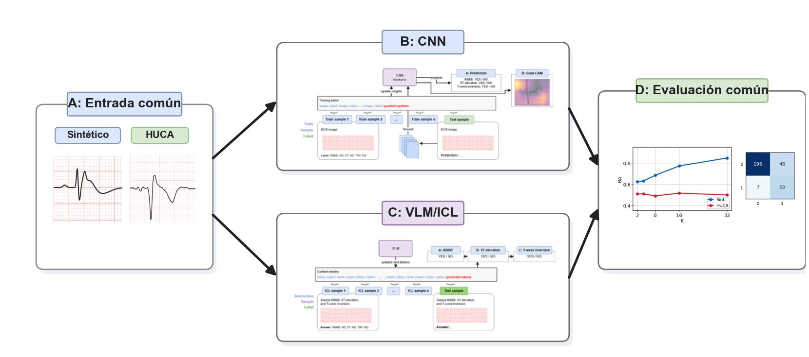

| Elemento | CNN ResNet18 | VLM/ICL Gemma 4 |
|---|---|---|
| Uso de \(K\) | Pacientes de entrenamiento | Demostraciones en el prompt |
| Actualización de pesos | Sí | No |
| Salida primaria | Tres hallazgos morfológicos | JSON estructurado |
| Agregación | Por paciente | Por paciente |
| Métrica principal | Exactitud equilibrada | Exactitud equilibrada |

Los valores de pocos ejemplos son:

```text
K = 2, 4, 8, 16, 32
K = 0 para zero-shot en VLM
semillas = 42, 123, 2026
```

La lectura de resultados se organiza desde el dominio más controlado hasta el dominio clínico:

1. Evaluación solo sintética.
2. Controles de transferencia sintético-real.
3. Evaluación sobre los datos reales cedidos por el HUCA.

## Datos

Se emplean dos fuentes. El simulador QRS/ST proporciona un dominio controlado con etiquetas morfológicas conocidas. Los datos cedidos por el Hospital Universitario Central de Asturias proporcionan una cohorte clínica real con referencia `clinical_brugada`.

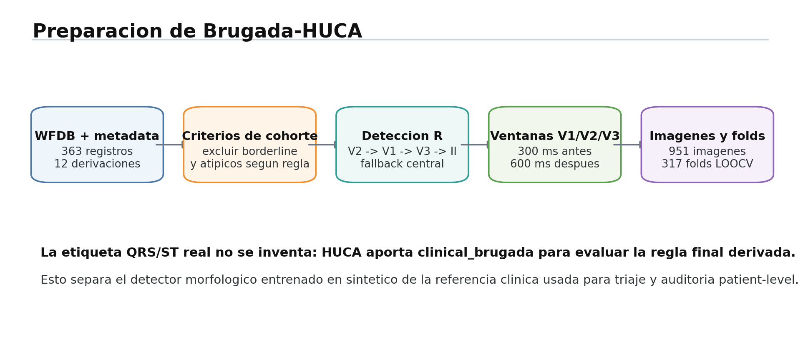

| Conjunto | Pacientes | Imágenes | Positivos | Negativos | Referencia |
|---|---:|---:|---:|---:|---|
| Simulador QRS/ST | 100 | 300 | 20 | 80 | Regla morfológica |
| Datos cedidos por el HUCA | 317 | 951 | 116 | 201 | `clinical_brugada` |

En el simulador, la etiqueta positiva se deriva de tres hallazgos:

```text
RBBB and ST_ELEVATION and T_WAVE_INVERSION -> positivo derivado
```

Los datos cedidos por el HUCA no contienen anotaciones independientes de RBBB, elevación ST e inversión de T por imagen. Esta limitación es metodológicamente importante: con la arquitectura morfológica usada en la CNN no existe un experimento supervisado real-real equivalente. Por ello, la evaluación real de la CNN mide transferencia desde el simulador hacia una referencia clínica.

## Enfoque CNN

La CNN se implementa como una ResNet18 con tres salidas morfológicas. Cada salida produce una probabilidad para uno de los hallazgos del simulador. La decisión positiva se deriva después mediante la regla de los tres hallazgos.

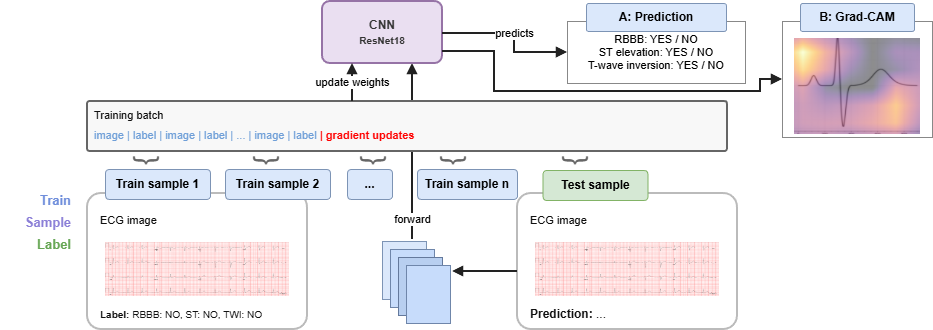

Configuración principal:

| Parámetro | Valor |
|---|---|
| Arquitectura | ResNet18 |
| Entrada | Imagen RGB de 224 x 224 |
| Salida | RBBB, elevación ST e inversión de T |
| Pérdida | BCE multietiqueta |
| Optimizador | AdamW |
| Épocas máximas | 20 |
| Umbral | Seleccionado en validación por exactitud equilibrada |

El umbral se selecciona dentro de cada pliegue usando solo pacientes de validación. El paciente reservado para test se evalúa con un criterio fijado antes de consultar su etiqueta.

## Enfoque VLM/ICL

El enfoque multimodal utiliza Gemma 4 como modelo de visión y lenguaje. El modelo recibe la imagen objetivo y, cuando \(K>0\), una secuencia previa de demostraciones con imagen y respuesta esperada. Los pesos permanecen fijos.

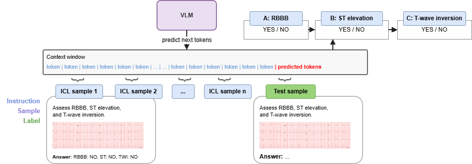

Se informan tres condiciones principales:

- `zero-shot`, sin ejemplos previos
- `ICL normal`, con demostraciones seleccionadas por el protocolo estándar
- `ICL balanceado`, con balance positivo-negativo cuando el pliegue lo permite

En los datos reales se distinguen dos orígenes del contexto:

- contexto real tomado de la cohorte cedida por el HUCA
- contexto sintético procedente del simulador

El segundo caso no se interpreta como resultado clínico principal. Funciona como control de transferencia sintético-real.

## Resultados en el simulador

En el dominio sintético, ambos enfoques detectan señal visual. La CNN aprovecha mejor el aumento de ejemplos, mientras que Gemma 4 mejora de forma clara frente a zero-shot cuando recibe demostraciones.

| Método | \(K\) | BA | F1 | Sens. | Esp. |
|---|---:|---:|---:|---:|---:|
| CNN ResNet18 | 32 | 0.848 | 0.673 | 0.883 | 0.812 |
| Gemma 4 zero-shot | 0 | 0.500 | 0.000 | 0.000 | 1.000 |
| Gemma 4 ICL normal | 16 | 0.750 | 0.529 | 0.817 | 0.683 |
| Gemma 4 ICL balanceado | 8 | 0.754 | 0.511 | 0.950 | 0.558 |

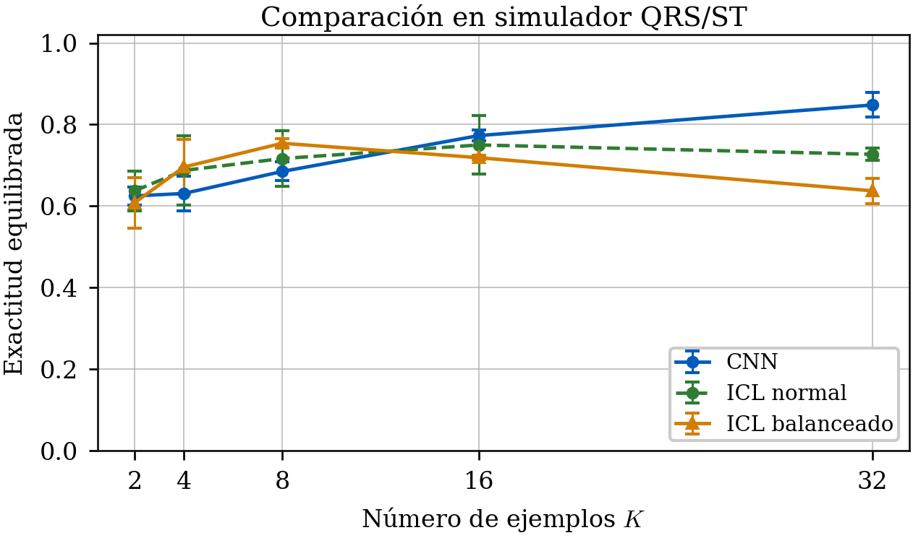
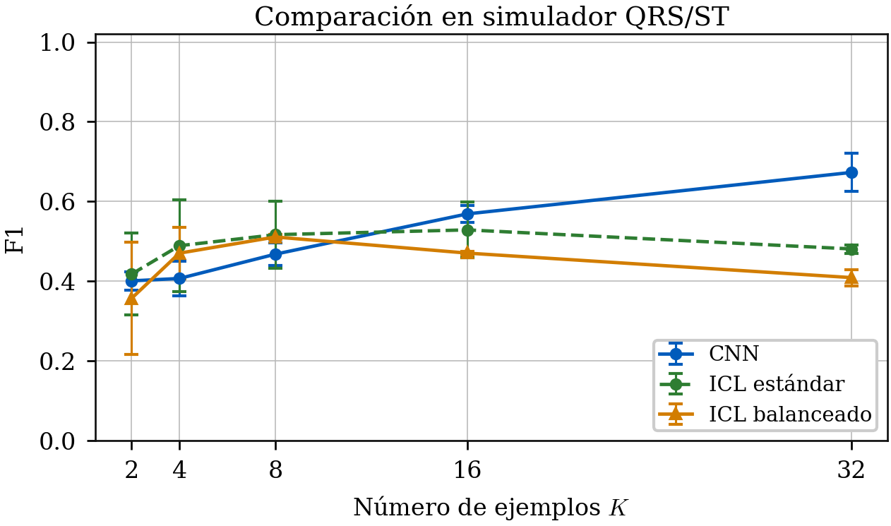

Las matrices de confusión resumen los mejores puntos de cada enfoque:


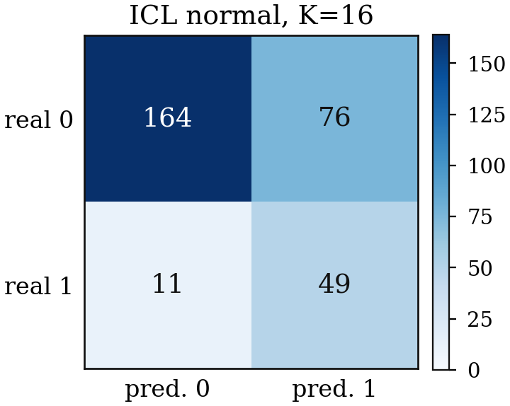
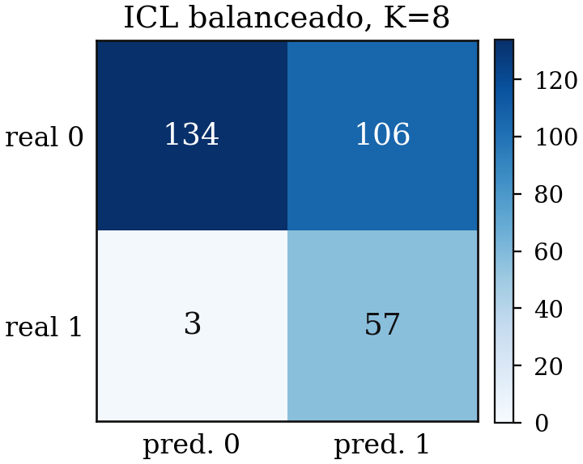

## Transferencia sintético-real

El resultado más relevante es la brecha entre el simulador y los datos clínicos. Un rendimiento alto en el dominio controlado no implica una transferencia robusta al dominio real.

### Adaptación de dominio CNN

Se evaluaron cuatro estrategias de adaptación de dominio no supervisada. En todos los casos, el simulador actúa como origen etiquetado y los datos cedidos por el HUCA como destino no etiquetado.

| Método | \(K\) | BA | F1 | Sens. | Esp. |
|---|---:|---:|---:|---:|---:|
| Base | 16 | 0.516 | 0.480 | 0.658 | 0.375 |
| SSL | 16 | 0.477 | 0.458 | 0.658 | 0.297 |
| CORAL | 16 | 0.524 | 0.481 | 0.641 | 0.408 |
| MMD | 16 | 0.516 | 0.474 | 0.635 | 0.396 |
| DANN | 16 | 0.515 | 0.470 | 0.621 | 0.410 |
| Base | 32 | 0.499 | 0.466 | 0.644 | 0.355 |
| SSL | 32 | 0.503 | 0.476 | 0.672 | 0.333 |
| CORAL | 32 | 0.528 | 0.480 | 0.632 | 0.423 |
| MMD | 32 | 0.549 | 0.498 | 0.649 | 0.448 |
| DANN | 32 | 0.509 | 0.472 | 0.644 | 0.375 |


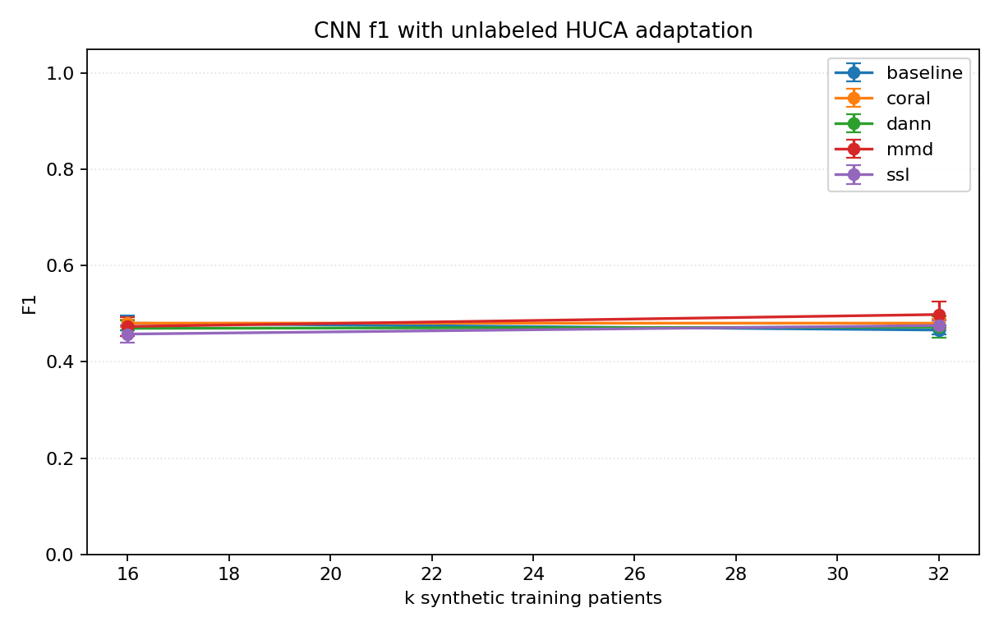

El mejor punto de esta batería es MMD con \(K=32\), BA 0.549. La mejora es moderada y no elimina la brecha de dominio.

### ICL con contexto sintético

El control VLM con contexto sintético usa demostraciones del simulador y consulta imágenes reales. Su objetivo es comprobar si las demostraciones morfológicas sintéticas orientan al modelo al cambiar de dominio.

| Condición | \(K\) | BA | F1 | Sens. | Esp. |
|---|---:|---:|---:|---:|---:|
| Zero-shot | 0 | 0.500 | 0.000 | 0.000 | 1.000 |
| ICL normal | 16 | 0.501 | 0.006 | 0.003 | 0.998 |
| ICL normal | 32 | 0.500 | 0.006 | 0.003 | 0.997 |
| ICL balanceado | 8 | 0.501 | 0.006 | 0.003 | 1.000 |
| ICL balanceado | 32 | 0.505 | 0.022 | 0.011 | 0.998 |

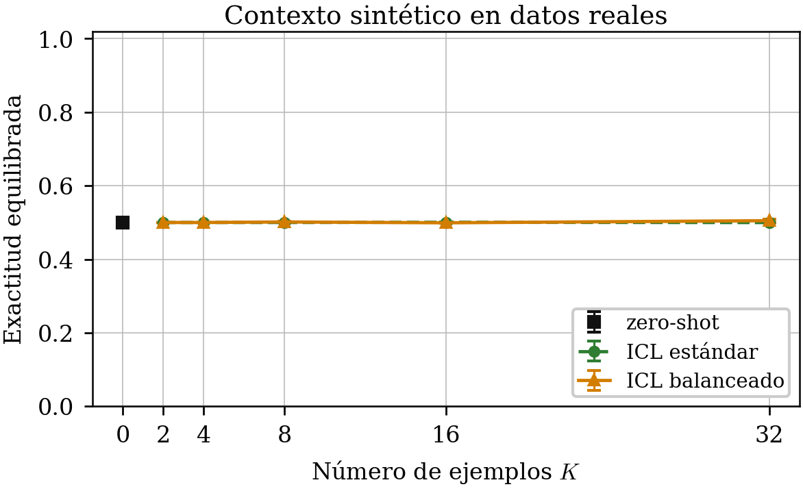
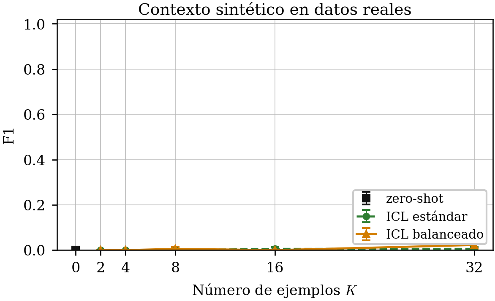

El modelo permanece prácticamente colapsado hacia la clase negativa. Este resultado confirma que el contexto sintético no transfiere de forma suficiente a la cohorte clínica.

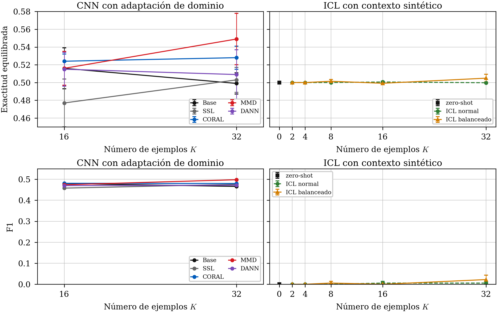

## Evaluación con datos reales cedidos por el HUCA

La comparación clínica principal enfrenta una CNN transferida desde el simulador con Gemma 4 usando contexto real de la cohorte cedida por el HUCA.

| Método | \(K\) | BA | F1 | Sens. | Esp. |
|---|---:|---:|---:|---:|---:|
| CNN ResNet18 base | 16 | 0.516 | 0.480 | 0.658 | 0.375 |
| CNN MMD | 32 | 0.549 | 0.498 | 0.649 | 0.448 |
| Gemma 4 zero-shot | 0 | 0.508 | 0.044 | 0.023 | 0.993 |
| Gemma 4 ICL normal | 16 | 0.522 | 0.491 | 0.690 | 0.355 |
| Gemma 4 ICL balanceado | 16 | 0.522 | 0.496 | 0.713 | 0.332 |
| Gemma 4 contexto sintético | 32 | 0.505 | 0.022 | 0.011 | 0.998 |

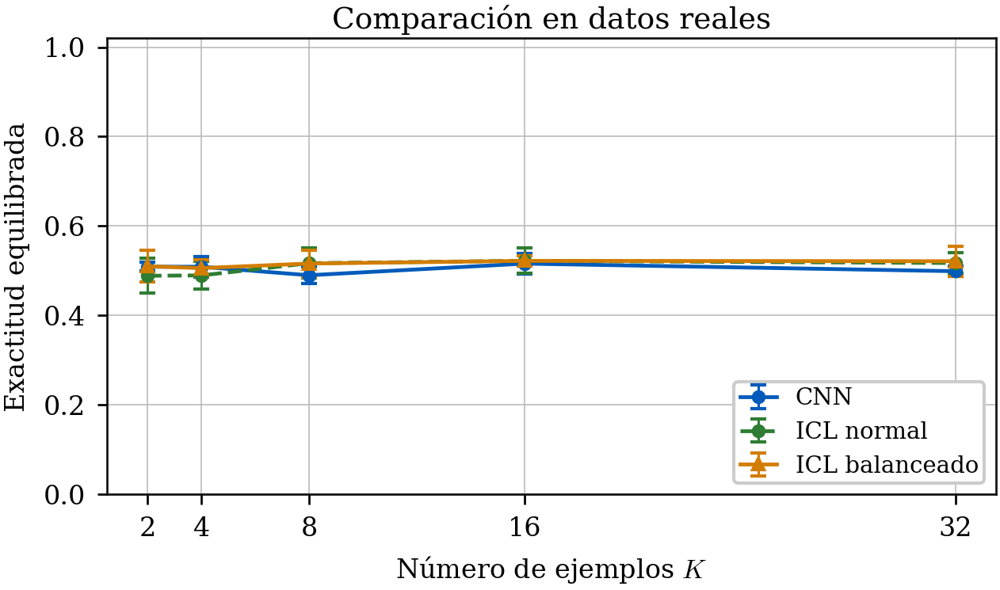
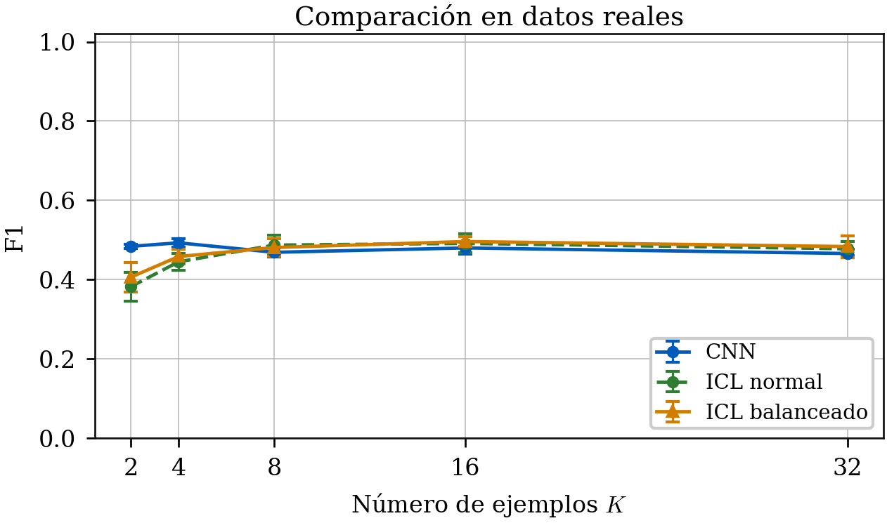

El zero-shot de Gemma 4 muestra una decisión conservadora casi monoclase. Al incorporar ejemplos reales en contexto, el modelo aumenta la sensibilidad y abandona el colapso inicial, aunque reduce la especificidad. En sentido metodológico, el ICL resulta efectivo como mecanismo de adaptación rápida frente a zero-shot. En sentido clínico, los resultados siguen siendo insuficientes para triaje fiable.

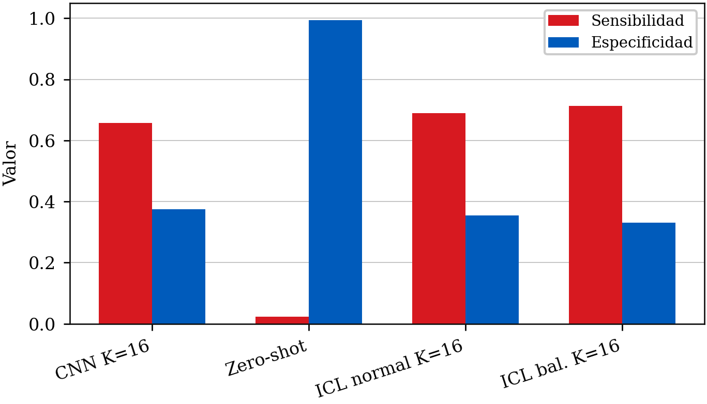
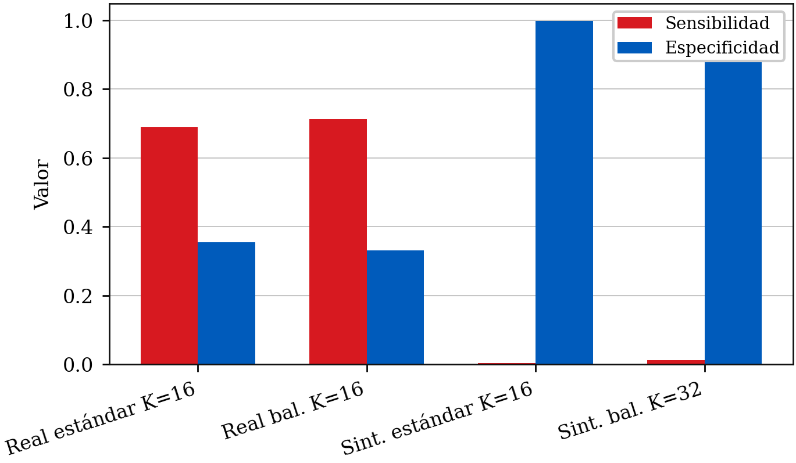

## Brecha de dominio integrada

Las curvas de brecha muestran que el simulador separa mejor la tarea para ambos paradigmas, pero esa ventaja no se conserva al pasar a una referencia clínica.

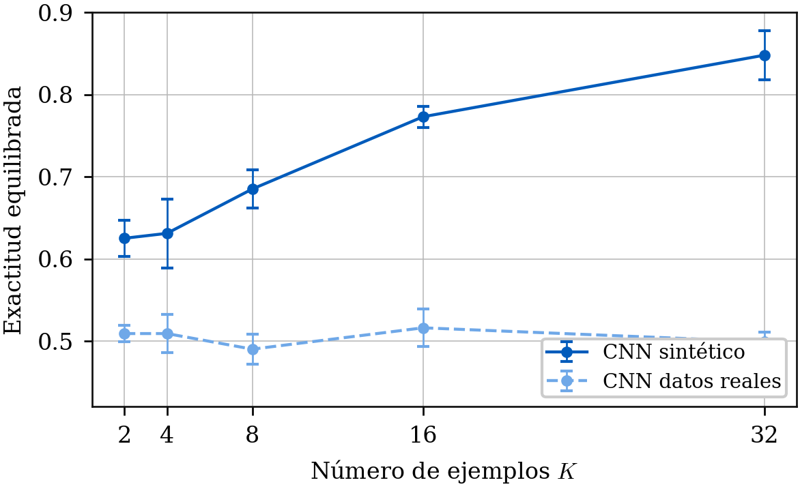
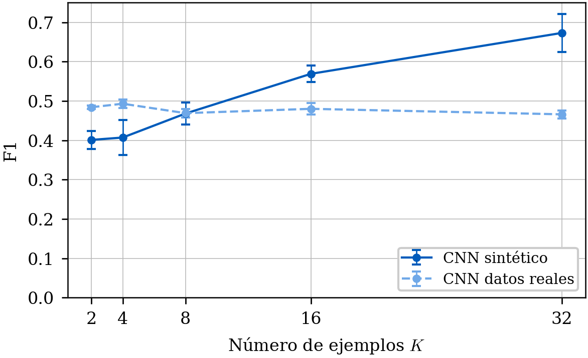
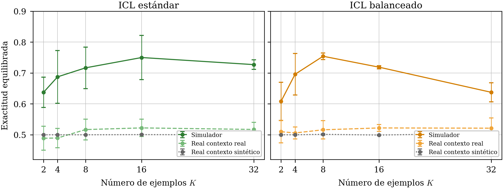
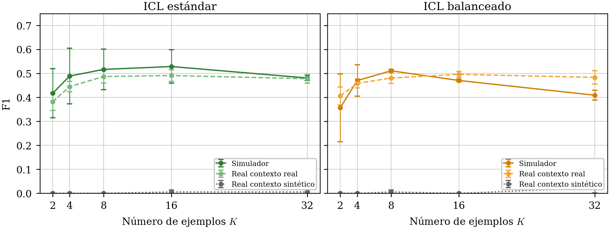

La interpretación conjunta es prudente:

- el simulador es útil como banco controlado
- la CNN aprende bien en sintético, pero transfiere mal de forma directa
- la adaptación de dominio reduce parcialmente la brecha
- el contexto sintético apenas ayuda al VLM sobre datos reales
- el contexto real cambia el régimen de predicción de Gemma 4
- ningún resultado justifica diagnóstico autónomo

## Organización del repositorio

```text
src/ecg_few/                    Código Python principal
scripts/run/                    Entradas reproducibles de ejecución
scripts/eval/                   Comparaciones y auditorías
scripts/thesis/                 Generación de figuras académicas
prompts/                        Prompts VLM estructurados
thesis/thesis/                  Fuente LaTeX y figuras del estudio
thesis/thesis/assets/results/   Diagramas y gráficas versionadas
```

## Reproducción

Instalación base:

```bash
uv sync --extra dev --extra cnn
```

Si se reconstruyen los datos reales desde WFDB:

```bash
uv sync --extra dev --extra cnn --extra real-data
```

Construcción de datasets:

```bash
scripts/run/build_simulator_qrs_dataset.sh
scripts/run/build_brugada_huca_dataset.sh
```

Evaluación CNN:

```bash
RESUME=0 scripts/run/run_cnn_simulator_qrs_loocv.sh
RESUME=0 scripts/run/run_cnn_loocv.sh
```

Adaptación de dominio:

```bash
METHOD=coral RESUME=0 scripts/run/run_cnn_domain_adaptation_loocv.sh
METHOD=mmd RESUME=0 scripts/run/run_cnn_domain_adaptation_loocv.sh
METHOD=dann RESUME=0 scripts/run/run_cnn_domain_adaptation_loocv.sh
METHOD=none SSL_PRETRAIN_EPOCHS=3 OUTPUT_ROOT=outputs/cnn_domain_adaptation/ssl REPORT_DIR=reports/loocv/cnn_domain_adaptation/ssl RESUME=0 scripts/run/run_cnn_domain_adaptation_loocv.sh
```

Evaluación VLM/ICL:

```bash
scripts/run/run_all_vlm_experiments.sh
```

Regeneración de figuras:

```bash
python scripts/thesis/render_comparative_result_figures.py
```

Validación rápida:

```bash
uv run --no-sync pytest -q
uv run --no-sync ruff check .
uv run --no-sync python -m compileall -q src scripts
```

## Limitaciones

El conjunto real no incluye etiquetas morfológicas independientes por imagen. La variable `clinical_brugada` es una referencia clínica de paciente y no equivale a la presencia aislada de RBBB, elevación ST e inversión de T en una ventana de ECG. Por tanto, la comparación real mezcla variabilidad visual, historia clínica, proceso diagnóstico y diferencias de dominio.

La evaluación se realiza sobre una cohorte concreta y requiere validación externa. Los resultados no deben interpretarse como rendimiento clínico prospectivo ni como base para automatizar decisiones asistenciales.

## Conclusión

El ECG como imagen contiene señal útil en condiciones controladas. La CNN aprende con claridad en el simulador, pero su transferencia directa a los datos reales cedidos por el HUCA es limitada. Gemma 4 en zero-shot tiende a colapsar hacia una clase. Con pocos ejemplos reales en contexto, el modelo modifica su régimen de predicción y aumenta la sensibilidad, lo que muestra que el ICL es efectivo como mecanismo metodológico de adaptación rápida.

La trayectoria de inteligencia portable sigue siendo prometedora para priorización de trazados, segunda lectura y exploración de cohortes raras sin reentrenar un modelo específico para cada escenario. Para que esa línea sea clínicamente aceptable harán falta más casos positivos, anotaciones morfológicas clínicas, validación externa y evaluación prospectiva.
