# ECG Few-Shot QRS/ST

Pipeline experimental del TFG para detectar criterios morfologicos QRS/ST en
ECG y derivar una decision Brugada de forma interpretable.

Ultima regeneracion local: 2026-06-27.

## Estado

| bloque | estado |
|---|---|
| Dataset sintetico QRS/ST | completo |
| Dataset real Brugada-HUCA procesado | completo |
| CNN sobre sintetico | completo |
| CNN sintetico -> HUCA | completo |
| Comparacion sintetico vs HUCA | completo |
| Domain adaptation sin etiquetas HUCA | completo |
| Auditoria CNN end-to-end | completa |
| VLM / ICL | TODO documentado |

La idea central es no entrenar una caja negra `Brugada/Normal` cuando el origen
del dato no permite justificarlo. La CNN aprende tres criterios morfologicos y
la decision clinica final se obtiene con una regla explicita:

```text
ECG -> CNN multi-label -> RBBB, ST_ELEVATION, T_WAVE_INVERSION
    -> regla AND -> Brugada / Normal
```

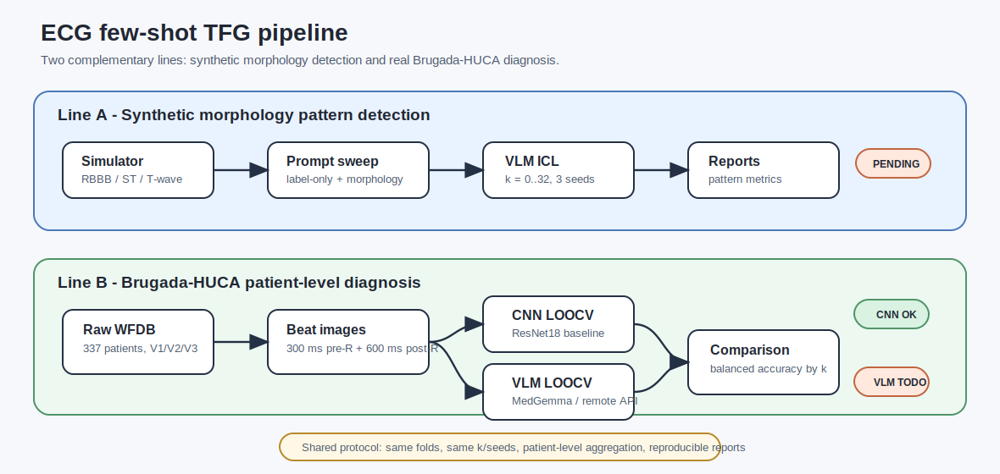

## Regla Clinica

El detector produce tres probabilidades:

- `RBBB`
- `ST_ELEVATION`
- `T_WAVE_INVERSION`

La etiqueta final se deriva asi:

```text
if RBBB and ST_ELEVATION and T_WAVE_INVERSION:
    final = Brugada
else:
    final = Normal
```

La implementacion canonica vive en `src/ecg_few/findings.py`.

## Datasets

### Sintetico QRS/ST

Se genera con:

```bash
scripts/run/build_simulator_qrs_dataset.sh
```

| dato | valor |
|---|---:|
| pacientes | 100 |
| imagenes | 300 |
| Brugada derivado, tres condiciones presentes | 20 |
| normal o incompleto | 80 |
| leads por paciente | V1, V2, V3 |

Cada imagen sintetica tiene etiquetas honestas para las tres condiciones:
`label_rbbb`, `label_st_elevation` y `label_t_wave_inversion`.

### Brugada-HUCA Real

Se reconstruye desde WFDB con:

```bash
scripts/run/build_brugada_huca_dataset.sh
```

| dato | valor |
|---|---:|
| pacientes incluidos | 317 |
| imagenes | 951 |
| Brugada clinico | 116 |
| Normal clinico | 201 |
| pacientes excluidos | 46 |
| leads por paciente | V1, V2, V3 |

En HUCA real las columnas QRS/ST quedan vacias a proposito. Solo se conserva
`clinical_brugada`; las etiquetas reales por condicion no existen en este
dataset procesado.

## Protocolo LOOCV

El protocolo es patient-level leave-one-out cross-validation.

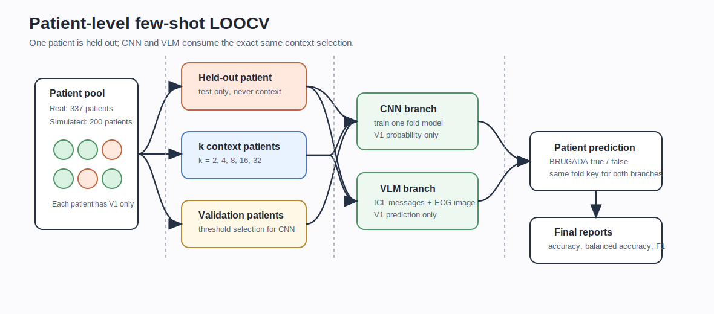

Para cada paciente:

1. Se deja el paciente como test.
2. Se seleccionan pacientes de contexto segun `k` y `seed`.
3. Se selecciona validacion para calibrar umbral cuando aplica.
4. La CNN predice las tres condiciones.
5. La regla AND produce `Brugada` o `Normal`.
6. Se compara contra la referencia patient-level.

Grid final:

```text
k = 2, 4, 8, 16, 32
seeds = 42, 123, 2026
```

Esto produce:

| dataset | pacientes por run | runs | predicciones patient-level |
|---|---:|---:|---:|
| sintetico | 100 | 15 | 1500 |
| HUCA | 317 | 15 | 4755 |

## CNN

Configuracion final:

```text
arquitectura: ResNet18
pesos: torchvision default
salidas: 3 logits multi-label
loss: BCEWithLogitsLoss
image_size: 224
epochs: 20
batch_size: 32
threshold_strategy: val_derived_balanced_accuracy
```

No queda selector de arquitectura ni ruta de CNN pequena: todos los experimentos
usan la misma ResNet18.

### CNN Sobre Sintetico

Comando:

```bash
RESUME=0 scripts/run/run_cnn_simulator_qrs_loocv.sh
```

| k | balanced accuracy | F1 | sensibilidad | especificidad | ROC AUC | AP |
|---:|---:|---:|---:|---:|---:|---:|
| 2 | 0.625 +/- 0.022 | 0.401 +/- 0.023 | 0.650 | 0.600 | 0.520 | 0.268 |
| 4 | 0.631 +/- 0.042 | 0.407 +/- 0.044 | 0.617 | 0.646 | 0.566 | 0.268 |
| 8 | 0.685 +/- 0.023 | 0.468 +/- 0.028 | 0.683 | 0.688 | 0.629 | 0.383 |
| 16 | 0.773 +/- 0.013 | 0.569 +/- 0.021 | 0.800 | 0.746 | 0.755 | 0.534 |
| 32 | 0.848 +/- 0.030 | 0.673 +/- 0.048 | 0.883 | 0.812 | 0.857 | 0.614 |

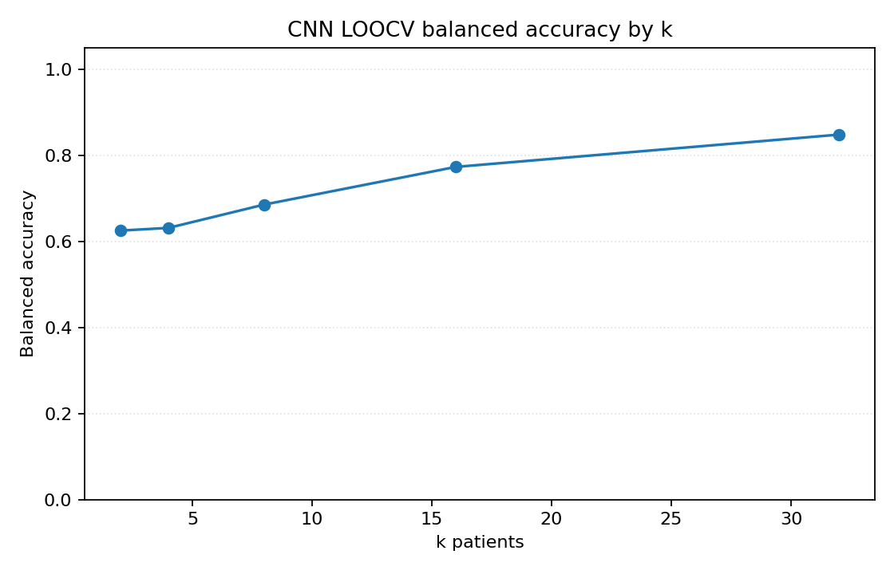

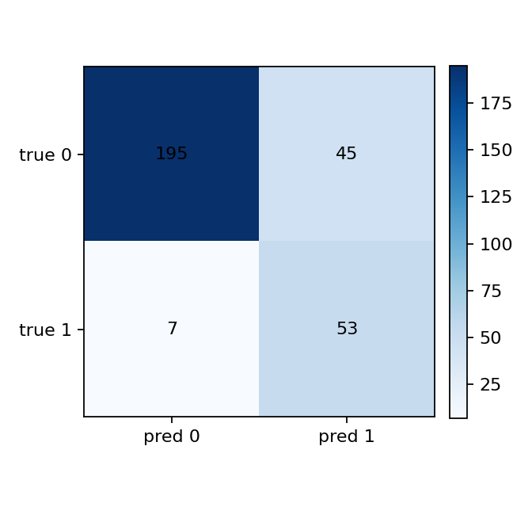

Lectura: en el mismo dominio generativo la mejora con `k` es clara. Esto valida
que el protocolo, la arquitectura y la regla derivada aprenden senales utiles
cuando no hay salto de dominio.

### CNN Sintetico -> HUCA

Comando:

```bash
RESUME=0 scripts/run/run_cnn_loocv.sh
```

Entrena con `data/simulator_qrs` y evalua sobre `data/brugada_huca`.
HUCA se usa como referencia clinica y para calibracion de umbral, no como fuente
de etiquetas QRS/ST inventadas.

| k | balanced accuracy | F1 | sensibilidad | especificidad | ROC AUC | AP |
|---:|---:|---:|---:|---:|---:|---:|
| 2 | 0.509 +/- 0.010 | 0.484 +/- 0.005 | 0.693 | 0.325 | 0.525 | 0.404 |
| 4 | 0.509 +/- 0.023 | 0.493 +/- 0.011 | 0.730 | 0.289 | 0.495 | 0.388 |
| 8 | 0.490 +/- 0.018 | 0.469 +/- 0.011 | 0.672 | 0.308 | 0.496 | 0.383 |
| 16 | 0.516 +/- 0.023 | 0.480 +/- 0.015 | 0.658 | 0.375 | 0.569 | 0.478 |
| 32 | 0.499 +/- 0.012 | 0.466 +/- 0.010 | 0.644 | 0.355 | 0.491 | 0.423 |

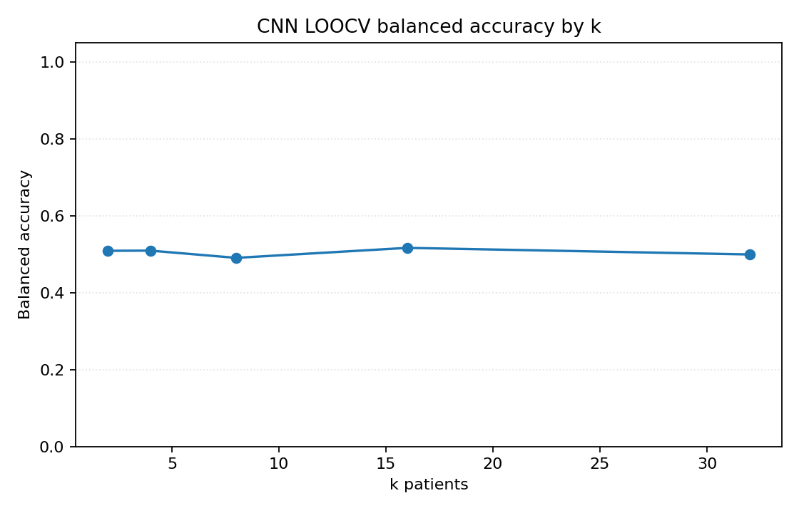

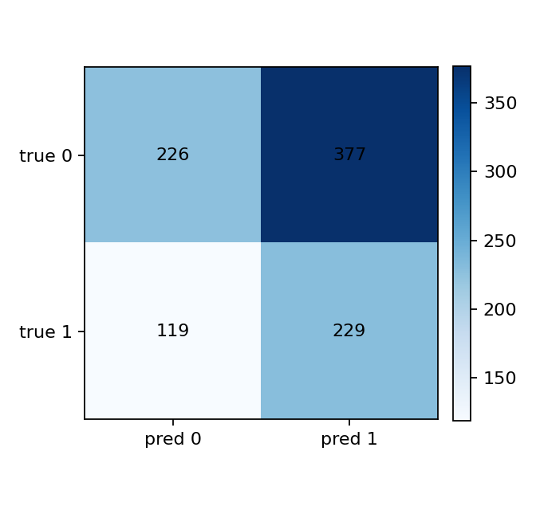

Lectura: el rendimiento real queda cerca de chance en balanced accuracy. La
sensibilidad es moderada, pero la especificidad baja indica sobredeteccion del
patron derivado en normales. El gap sintetico-real es el problema principal.

## Comparacion Sintetico vs HUCA

| k | BA sintetico | BA HUCA | F1 sintetico | F1 HUCA |
|---:|---:|---:|---:|---:|
| 2 | 0.625 | 0.509 | 0.401 | 0.484 |
| 4 | 0.631 | 0.509 | 0.407 | 0.493 |
| 8 | 0.685 | 0.490 | 0.468 | 0.469 |
| 16 | 0.773 | 0.516 | 0.569 | 0.480 |
| 32 | 0.848 | 0.499 | 0.673 | 0.466 |

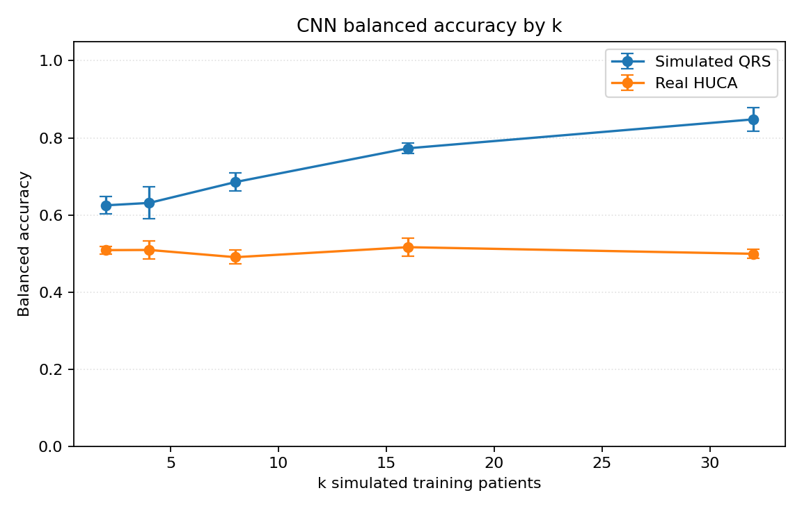

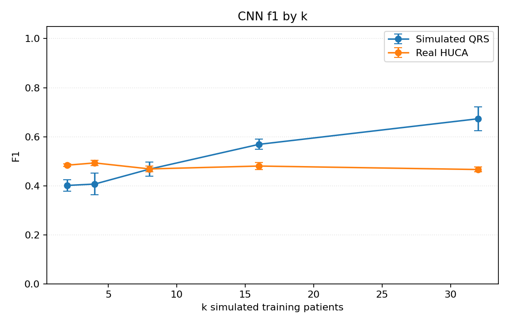

El F1 no debe leerse aislado porque la prevalencia cambia: el sintetico tiene
20/100 positivos derivados, mientras HUCA tiene 116/317 positivos clinicos. La
balanced accuracy es la metrica principal de lectura.

## Adaptacion De Dominio

Objetivo: usar HUCA como dominio objetivo no etiquetado sin inventar etiquetas
QRS/ST.

```text
fuente etiquetada: data/simulator_qrs
objetivo no etiquetado: data/brugada_huca
salida: RBBB/ST_ELEVATION/T_WAVE_INVERSION -> regla AND -> Brugada/Normal
```

Metodos ejecutados:

- `ssl`: preentrenamiento SimCLR del encoder con HUCA sin etiquetas.
- `coral`: alineacion de covarianza de features.
- `mmd`: alineacion de distribucion con kernel RBF.
- `dann`: clasificador de dominio con gradient reversal.

Comandos:

```bash
METHOD=coral RESUME=0 scripts/run/run_cnn_domain_adaptation_loocv.sh
METHOD=mmd RESUME=0 scripts/run/run_cnn_domain_adaptation_loocv.sh
METHOD=dann RESUME=0 scripts/run/run_cnn_domain_adaptation_loocv.sh
METHOD=none SSL_PRETRAIN_EPOCHS=3 OUTPUT_ROOT=outputs/cnn_domain_adaptation/ssl REPORT_DIR=reports/loocv/cnn_domain_adaptation/ssl RESUME=0 scripts/run/run_cnn_domain_adaptation_loocv.sh
```

Comparacion:

```bash
uv run --no-sync python scripts/eval/compare_cnn_domain_adaptation_reports.py
```

Resultados `k=16,32`:

| metodo | k | balanced accuracy | F1 | sensibilidad | especificidad |
|---|---:|---:|---:|---:|---:|
| baseline | 16 | 0.516 +/- 0.023 | 0.480 | 0.658 | 0.375 |
| ssl | 16 | 0.477 +/- 0.027 | 0.458 | 0.658 | 0.297 |
| coral | 16 | 0.524 +/- 0.008 | 0.481 | 0.641 | 0.408 |
| mmd | 16 | 0.516 +/- 0.019 | 0.474 | 0.635 | 0.396 |
| dann | 16 | 0.515 +/- 0.019 | 0.470 | 0.621 | 0.410 |
| baseline | 32 | 0.499 +/- 0.012 | 0.466 | 0.644 | 0.355 |
| ssl | 32 | 0.503 +/- 0.014 | 0.476 | 0.672 | 0.333 |
| coral | 32 | 0.528 +/- 0.013 | 0.480 | 0.632 | 0.423 |
| mmd | 32 | 0.549 +/- 0.029 | 0.498 | 0.649 | 0.448 |
| dann | 32 | 0.509 +/- 0.028 | 0.472 | 0.644 | 0.375 |

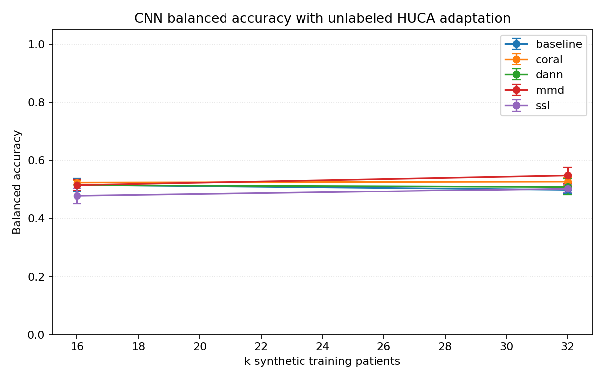


Lectura: la mejor configuracion HUCA de esta bateria es `mmd` con `k=32`
(`BA=0.549`). CORAL tambien mejora `k=32`. La adaptacion de dominio ayuda sobre
el baseline de `k=32`, sobre todo recuperando especificidad, pero el techo sigue
siendo modesto.

## Grad-CAM

El pipeline guarda paneles Grad-CAM por fold en `outputs/.../gradcam_panel.png`.
Sirven para inspeccionar si la CNN mira regiones compatibles con QRS, ST y
repolarizacion.

Ejemplo sintetico:

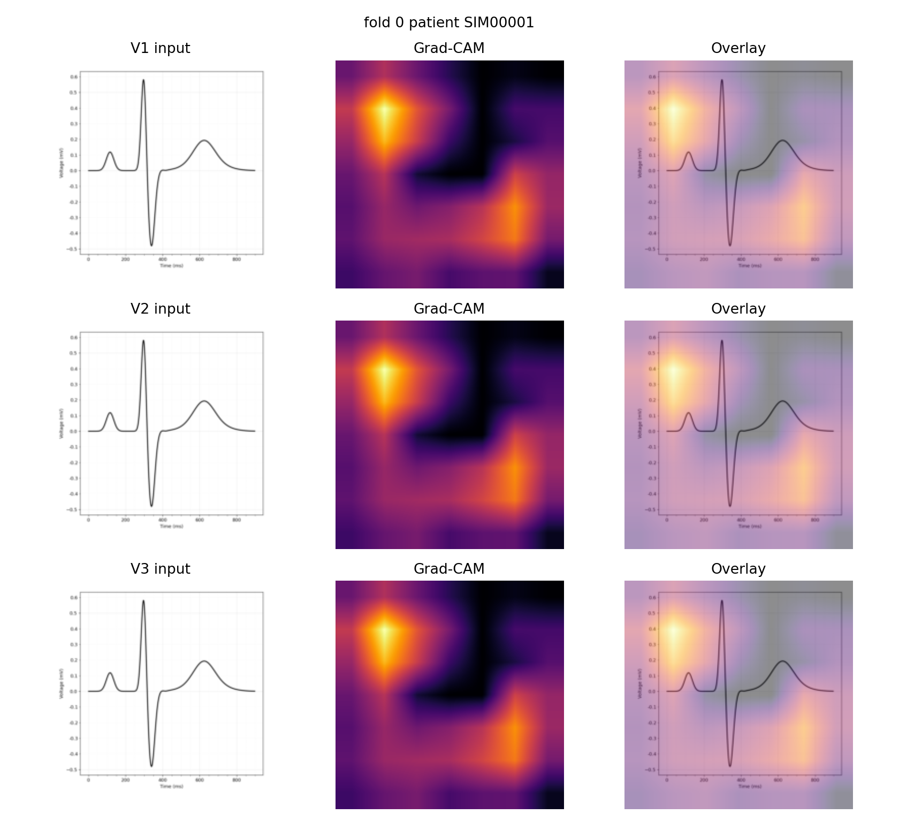

Ejemplo HUCA:

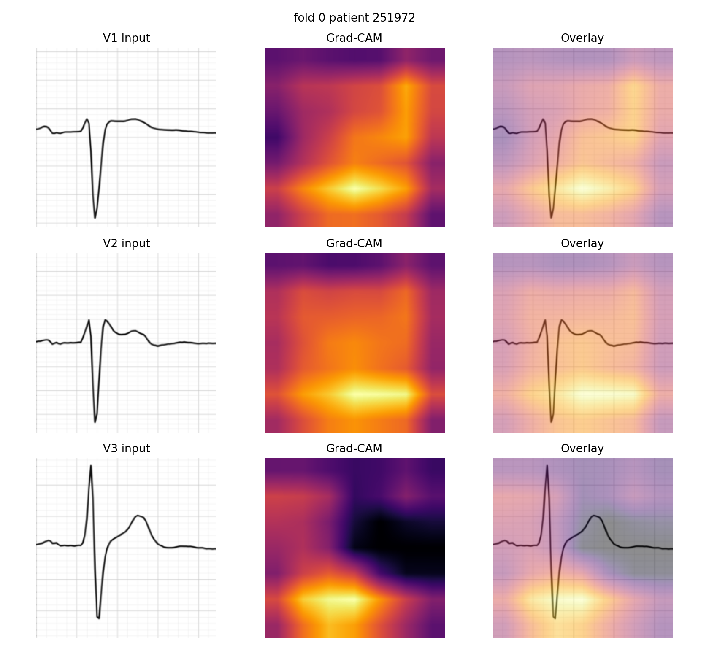

## VLM / ICL TODO

La ruta VLM queda preparada, pero no forma parte del cierre numerico actual.

Semantica prevista:

```text
imagen ECG -> JSON con RBBB/ST_ELEVATION/T_WAVE_INVERSION -> regla AND
```

Comando de inferencia previsto:

```bash
API_BASE=http://your-host:8000/v1 \
MODEL=google/medgemma-4b-it \
scripts/run/run_vlm_loocv.sh
```

Validacion sin inferencia:

```bash
API_BASE=http://your-host:8000/v1 \
MODEL=google/medgemma-4b-it \
scripts/run/validate_vlm_loocv.sh
```

Prompts:

```text
prompts/system/qrs_huca.md
prompts/qrs/right_precordial_morphology.md
```

TODO para cerrar VLM:

- Ejecutar inferencia completa con el mismo fold plan.
- Validar JSON, votos por lead y agregacion por paciente.
- Generar `reports/loocv/vlm`.
- Activar auditoria con `--vlm-policy required`.
- Comparar CNN vs VLM en `reports/loocv/comparison`.

## Artefactos

Datasets:

```text
data/simulator_qrs/
data/brugada_huca/
```

Salidas CNN:

```text
outputs/cnn_simulator_qrs_loocv/
outputs/cnn_loocv/
outputs/cnn_domain_adaptation/
```

Reportes:

```text
reports/loocv/cnn_simulator_qrs/
reports/loocv/cnn/
reports/loocv/cnn_comparison/
reports/loocv/cnn_domain_adaptation/
reports/loocv/audit/
```

Figuras versionadas para este README:

```text
assets/readme/
```

## Reproduccion

Instalacion:

```bash
uv sync --extra dev --extra cnn
```

Si se reconstruye HUCA desde WFDB:

```bash
uv sync --extra dev --extra cnn --extra real-data
```

Reconstruir datasets:

```bash
scripts/run/build_simulator_qrs_dataset.sh
scripts/run/build_brugada_huca_dataset.sh
```

Relanzar CNNs:

```bash
RESUME=0 scripts/run/run_cnn_simulator_qrs_loocv.sh
RESUME=0 scripts/run/run_cnn_loocv.sh
```

Relanzar domain adaptation:

```bash
METHOD=coral RESUME=0 scripts/run/run_cnn_domain_adaptation_loocv.sh
METHOD=mmd RESUME=0 scripts/run/run_cnn_domain_adaptation_loocv.sh
METHOD=dann RESUME=0 scripts/run/run_cnn_domain_adaptation_loocv.sh
METHOD=none SSL_PRETRAIN_EPOCHS=3 OUTPUT_ROOT=outputs/cnn_domain_adaptation/ssl REPORT_DIR=reports/loocv/cnn_domain_adaptation/ssl RESUME=0 scripts/run/run_cnn_domain_adaptation_loocv.sh
```

Comparaciones y auditoria:

```bash
uv run --no-sync python scripts/eval/compare_cnn_sim_real_reports.py
uv run --no-sync python scripts/eval/compare_cnn_domain_adaptation_reports.py
uv run --no-sync python scripts/eval/audit_loocv_results.py
```

Validacion de codigo:

```bash
uv run --no-sync pytest -q
uv run --no-sync ruff check .
uv run --no-sync python -m compileall -q src scripts
```

## Conclusiones

- En sintetico, la CNN multi-label aprende de forma consistente y mejora con
  mas contexto.
- En HUCA, el salto de dominio degrada claramente la balanced accuracy.
- La decision derivada es interpretable, pero la especificidad real sigue baja.
- La adaptacion de dominio no supervisada mejora el mejor punto `k=32`, con MMD
  como configuracion mas fuerte de esta bateria.
- VLM queda preparado como siguiente bloque, no como resultado final de esta
  entrega CNN.
